<!-- ───────────────────────── HEADER ───────────────────────── -->
<p align="center">
  
</p>

<p align="center">
  <a href="https://github.com/winter000boy">
    
  </a>
</p>

<p align="center">
  <a href="https://winter000boy.github.io/My-Portfolio/"></a>
  <a href="https://linkedin.com/in/sharmajidurgesh"></a>
  <a href="https://x.com/Durgesh00Sharma"></a>
  <a href="mailto:sharmajidurgesh04@gmail.com"></a>
</p>

<p align="center">
  
  
  
</p>

---

## 👨‍💻 About me

```java
public class DurgeshSharma {

    String   role      = "Software Engineer @ Trust3 AI";
    String   focus     = "AI governance · backend systems · data platforms";
    String[] coreStack = { "Java", "Spring Boot", "Node.js", "Python", "React", "PostgreSQL" };
    String   learning  = "Distributed systems, system design, cloud-native architecture";
    String   education = "B.E. Artificial Intelligence & Data Science (2025)";
    String   basedIn   = "Nashik, India 🇮🇳";

    String funFact() {
        return "I build trading screeners and tinker with ML models for fun.";
    }
}
```

- 🛡️ **Now:** engineering AI governance & data-security tooling at **Trust3 AI**
- 🧠 **Background:** ML/NLP for enterprise automation, full-stack Java & MERN apps
- 📚 **Learning in public:** [Software-Engineering-Mastery](https://github.com/winter000boy/Software-Engineering-Mastery) — Java fundamentals → production-grade distributed systems
- 💬 **Ask me about:** Spring Boot, REST & event-driven APIs, databases, applied ML

---

## 🧰 Tech stack

<table align="center">
  <tr>
    <td align="center" width="140"><b>Languages</b></td>
    <td></td>
  </tr>
  <tr>
    <td align="center"><b>Backend</b></td>
    <td></td>
  </tr>
  <tr>
    <td align="center"><b>Frontend</b></td>
    <td></td>
  </tr>
  <tr>
    <td align="center"><b>Data &amp; AI</b></td>
    <td></td>
  </tr>
  <tr>
    <td align="center"><b>Cloud &amp; DevOps</b></td>
    <td></td>
  </tr>
  <tr>
    <td align="center"><b>Tools</b></td>
    <td></td>
  </tr>
</table>

---

## 🚀 Featured projects

<table>
  <tr>
    <td width="50%" valign="top">
      <h3><a href="https://github.com/winter000boy/NeuroFlow">⚡ NeuroFlow</a></h3>
      Zapier-style workflow automation platform on top of the n8n engine, with real-time execution monitoring over WebSockets.
      <br /><br />
      
      
      
      
    </td>
    <td width="50%" valign="top">
      <h3><a href="https://github.com/winter000boy/Neuroflow-ERP">🏫 Neuroflow ERP</a></h3>
      Institute management system for leads, students, batches, employees and placements.
      <br /><br />
      
      
      
    </td>
  </tr>
  <tr>
    <td width="50%" valign="top">
      <h3><a href="https://github.com/winter000boy/Shop-Application">🛠️ Shop Management System</a></h3>
      Full-stack app for mobile & hardware repair shops: repair orders, customers, and shop auth.
      <br /><br />
      
      
      
    </td>
    <td width="50%" valign="top">
      <h3><a href="https://github.com/winter000boy/Chat-Application">💬 Real-time Chat</a></h3>
      Low-latency chat over WebSockets using the STOMP protocol with SockJS fallback.
      <br /><br />
      
      
      
    </td>
  </tr>
  <tr>
    <td width="50%" valign="top">
      <h3><a href="https://github.com/winter000boy/AI-Powered-Call-Center">🚆 AI-Powered Call Center</a></h3>
      Virtual call-center assistant for Indian Railways that answers passenger queries with AI.
      <br /><br />
      
      
    </td>
    <td width="50%" valign="top">
      <h3><a href="https://github.com/winter000boy/Daily-Market-Analysis">📈 Daily Market Analysis</a></h3>
      Local daily routine that screens NSE/BSE stocks for swing trades and tracks positions & P&amp;L.
      <br /><br />
      
      
    </td>
  </tr>
</table>

<p align="center">
  <a href="https://github.com/winter000boy?tab=repositories"></a>
</p>

---

## 💼 Experience

| | Role | Organization | When |
|:-:|---|---|---|
| 🛡️ | **Software Engineer** — AI governance & data security platform | [Trust3 AI](https://trust3.ai) | Present |
| 🤖 | **AI Engineer Intern** — ML models & NLP for enterprise automation | Infosys | Nov 2024 – 2025 |

## 🎓 Education

**B.E. in Artificial Intelligence & Data Science** — Pune Vidyarthi Griha's COE & SD Institute of Management, Nashik *(2021 – 2025)*

<details>
<summary><b>🏆 Certifications</b></summary>
<br />

- Advanced Data Structures and Algorithms (DSA)
- Full Stack Web Development with Java — Udemy

</details>

---

## 📊 GitHub analytics

<p align="center">
  <picture>
    <source media="(prefers-color-scheme: dark)" srcset="./profile-summary-card-output/tokyonight/0-profile-details.svg" />
    
  </picture>
</p>

<p align="center">
  <picture>
    <source media="(prefers-color-scheme: dark)" srcset="./profile-summary-card-output/tokyonight/3-stats.svg" />
    
  </picture>
  <picture>
    <source media="(prefers-color-scheme: dark)" srcset="./profile-summary-card-output/tokyonight/4-productive-time.svg" />
    
  </picture>
</p>

<p align="center">
  <picture>
    <source media="(prefers-color-scheme: dark)" srcset="./profile-summary-card-output/tokyonight/1-repos-per-language.svg" />
    
  </picture>
  <picture>
    <source media="(prefers-color-scheme: dark)" srcset="./profile-summary-card-output/tokyonight/2-most-commit-language.svg" />
    
  </picture>
</p>

<p align="center">
  <picture>
    <source media="(prefers-color-scheme: dark)" srcset="https://streak-stats.demolab.com?user=winter000boy&theme=tokyonight&hide_border=true&background=0D1117&ring=7F5AF0&fire=00D9FF&currStreakLabel=00D9FF" />
    
  </picture>
</p>

<details>
<summary><b>🔬 Detailed metrics (languages, habits, lines of code, recent repos)</b></summary>
<br />
<p align="center">
  
</p>
</details>

---

## 🐍 Contribution snake

<p align="center">
  <picture>
    <source media="(prefers-color-scheme: dark)" srcset="https://raw.githubusercontent.com/winter000boy/winter000boy/output/snake-dark.svg" />
    
  </picture>
</p>

---

<p align="center">
  <i>“Every line of code should make the system smarter, faster, or kinder.”</i>
</p>


